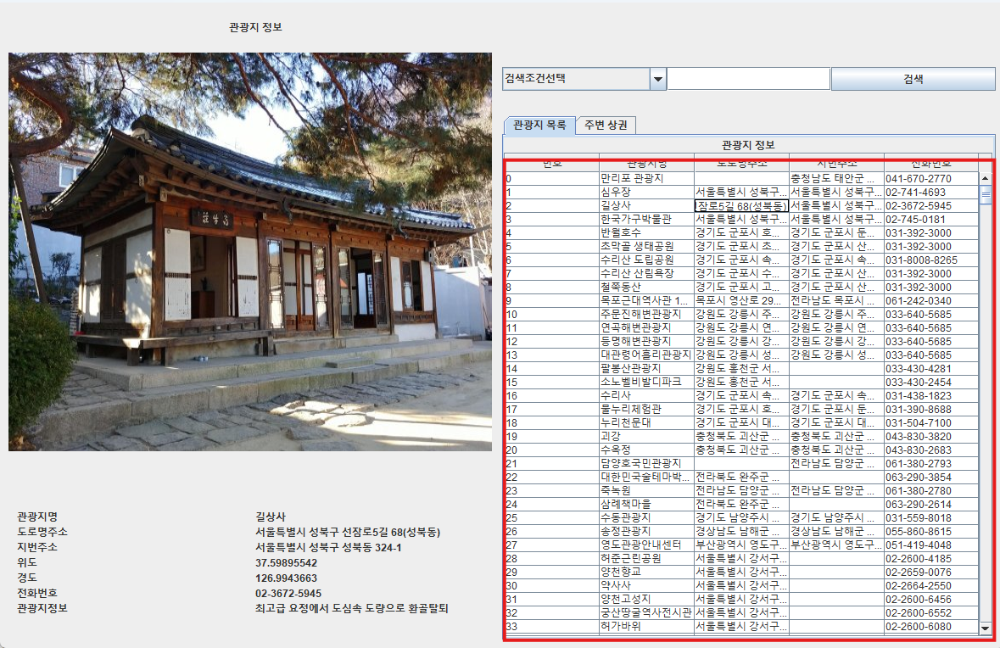
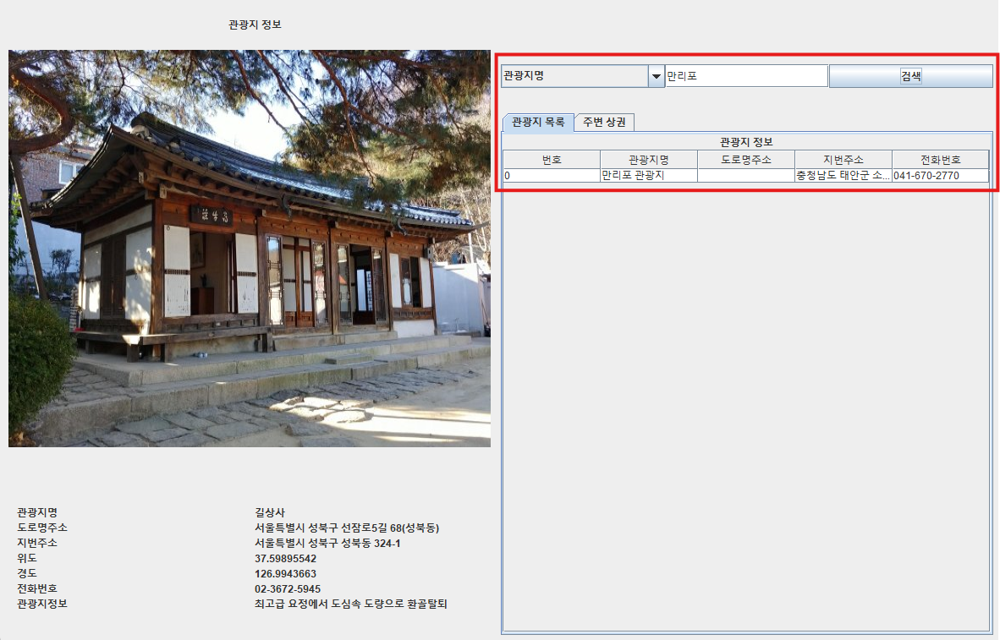
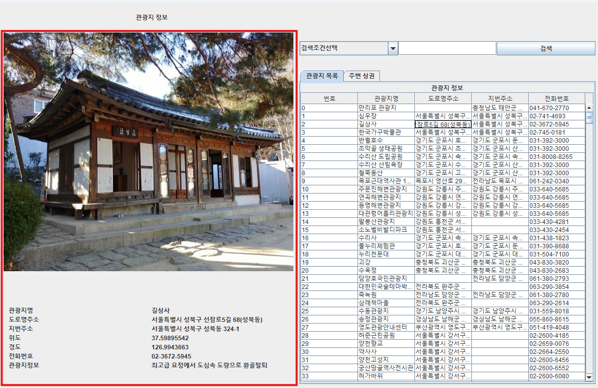
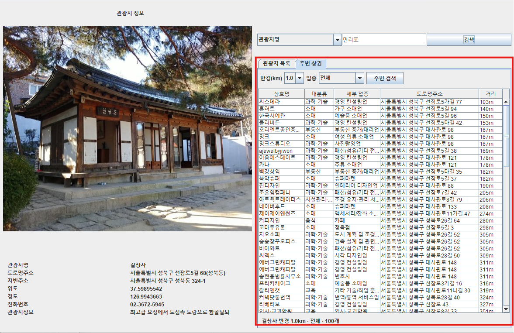
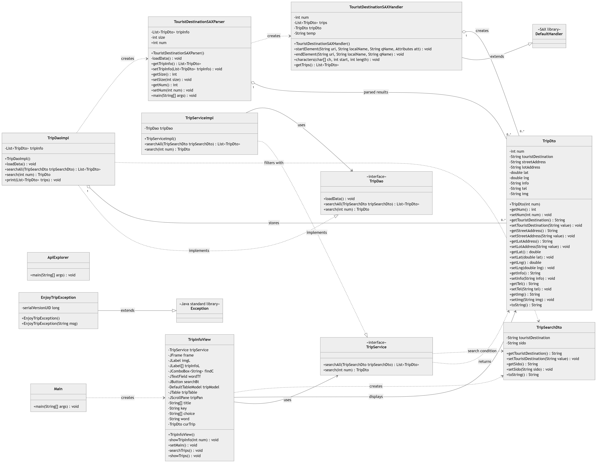

# EnjoyTrip

전국 관광지 표준 데이터를 검색하고 상세 정보를 확인할 수 있는 Java Swing 데스크톱 애플리케이션입니다.
XML 데이터를 SAX Parser로 읽어 메모리에 적재하며, 관광지명 또는 주소를 기준으로 원하는 관광지를 조회할 수 있습니다.


## 주요 기능

- 전국 관광지 XML 데이터 로딩
- 전체 관광지 목록 조회
- 관광지명 검색
- 시·도 및 주소 검색
- 선택한 관광지의 상세 정보 표시
  - 관광지명
  - 도로명 주소 및 지번 주소
  - 위도와 경도
  - 관리기관 전화번호
  - 관광지 소개
  - 관광지 이미지
- Swing 기반 데스크톱 사용자 인터페이스
- View, Service, DAO, DTO로 역할을 분리한 계층형 구조

## 실행 화면의 동작

프로그램을 실행하면 왼쪽에는 선택한 관광지의 상세 정보와 이미지가 표시되고, 오른쪽에는 검색 영역과 관광지 목록이 표시됩니다.

1. 검색 조건에서 `관광지명` 또는 `주소`를 선택합니다.
2. 검색어를 입력하고 검색 버튼을 누릅니다.
3. 조건과 일치하는 관광지가 표에 표시됩니다.
4. 표의 행을 선택하면 해당 관광지의 상세 정보가 왼쪽에 표시됩니다.
5. 검색 조건이나 검색어가 없으면 전체 관광지 목록을 조회합니다.

## 요구사항 산출물별 실행 화면

### F101 - 관광지 목록 조회

프로그램을 실행하면 전국 관광지 목록을 표 형태로 조회할 수 있습니다.



### F102 - 관광지 검색

검색 조건과 검색어를 입력하면 조건에 일치하는 관광지만 목록에 표시됩니다.



### F103 - 관광지 상세 정보 조회

관광지 목록에서 행을 선택하면 관광지 이미지, 주소, 위치, 전화번호 및 소개를 상세 화면에서 확인할 수 있습니다.



### F105 - 주변 상권 조회

선택한 관광지를 기준으로 검색 반경과 업종을 지정하여 주변 상권의 상호명, 업종, 주소 및 거리를 조회할 수 있습니다.



## 기술 스택

| 구분 | 기술 |
| --- | --- |
| Language | Java 8 이상 |
| GUI | Java Swing, AWT |
| Data parsing | Java SAX Parser |
| Data format | XML |
| IDE metadata | Eclipse Java Project |
| External dependency | 없음 |

Swing과 SAX Parser는 JDK에 포함된 표준 라이브러리이므로 별도의 라이브러리를 내려받을 필요가 없습니다.

## 프로젝트 구조

```text
EnjoyTrip/
├─ src/
│  └─ com/ssafy/trip/
│     ├─ Main.java
│     ├─ ApiExplorer.java
│     ├─ EnjoyTripException.java
│     ├─ model/
│     │  ├─ dao/
│     │  │  ├─ TripDao.java
│     │  │  └─ TripDaoImpl.java
│     │  ├─ dto/
│     │  │  ├─ TripDto.java
│     │  │  └─ TripSearchDto.java
│     │  └─ service/
│     │     ├─ TripService.java
│     │     └─ TripServiceImpl.java
│     ├─ util/
│     │  ├─ TouristDestinationSAXParser.java
│     │  └─ TouristDestinationSAXHandler.java
│     └─ view/
│        └─ TripInfoView.java
├─ res/
│  ├─ 전국관광지정보표준데이터.xml
│  ├─ 전국관광지정보표준데이터.csv
│  └─ 전국관광지정보표준데이터.json
├─ img/
│  ├─ image01.jpg ... image11.jpg
│  └─ no_image.jpg
├─ uml/
│  ├─ class-diagram.md
│  └─ EnjoyTrip.cld
├─ mermaid-diagram.png
├─ .classpath
├─ .project
└─ README.md
```

`bin/`은 컴파일 결과가 생성되는 디렉터리이며 버전 관리 대상에서 제외됩니다. 데이터 파일은 세 가지 형식으로 제공되지만 현재 애플리케이션은 XML 파일만 사용합니다.

## 아키텍처

애플리케이션의 주요 호출 흐름은 다음과 같습니다.

```text
Main
  └─ TripInfoView
       └─ TripService / TripServiceImpl
            └─ TripDao / TripDaoImpl
                 └─ TouristDestinationSAXParser
                      └─ TouristDestinationSAXHandler
                           └─ TripDto
```

| 계층 | 클래스 | 역할 |
| --- | --- | --- |
| Entry point | `Main` | Swing 애플리케이션 시작 |
| View | `TripInfoView` | 화면 구성, 사용자 입력 처리, 검색 결과 및 상세 정보 표시 |
| Service | `TripService`, `TripServiceImpl` | View의 요청을 DAO에 전달하는 서비스 계층 |
| DAO | `TripDao`, `TripDaoImpl` | 관광지 데이터 로딩, 목록 검색 및 단건 조회 |
| DTO | `TripDto` | 관광지 한 건의 데이터 전달 |
| DTO | `TripSearchDto` | 관광지명과 시·도 검색 조건 전달 |
| Parser | `TouristDestinationSAXParser` | XML 파서 생성 및 데이터 로딩 |
| SAX Handler | `TouristDestinationSAXHandler` | XML 요소를 읽어 `TripDto` 객체로 변환 |
| API sample | `ApiExplorer` | 공공데이터 API 호출 예제이며 기본 실행 흐름과는 분리됨 |

### 데이터 처리 흐름

1. `Main`이 `TripInfoView`를 생성합니다.
2. `TripInfoView`가 `TripServiceImpl`을 생성합니다.
3. `TripServiceImpl`이 `TripDaoImpl`을 생성합니다.
4. `TripDaoImpl` 생성 시 XML 데이터를 로딩합니다.
5. `TouristDestinationSAXParser`가 `TouristDestinationSAXHandler`를 이용해 XML을 파싱합니다.
6. Handler가 각 `<record>`를 `TripDto`로 변환합니다.
7. DAO가 생성된 `TripDto` 목록을 메모리에 보관하고 검색 요청에 사용합니다.

## 클래스 다이어그램



필드와 메서드를 포함한 Mermaid 원본은 [클래스 다이어그램 문서](uml/class-diagram.md)에서 확인할 수 있습니다. 기존 클래스 다이어그램 편집 파일은 `uml/EnjoyTrip.cld`에 있습니다.

## 실행 환경

실행 전에 다음 항목을 준비합니다.

- JDK 8 이상
- GUI를 표시할 수 있는 데스크톱 환경
- UTF-8을 지원하는 IDE 또는 터미널

버전 확인:

```powershell
java -version
javac -version
```

이 프로젝트는 XML과 이미지 파일을 상대 경로로 읽습니다. 따라서 실행 시 현재 작업 디렉터리가 반드시 프로젝트 루트인 `EnjoyTrip`이어야 합니다.

## 실행 방법

### Eclipse에서 실행

1. Eclipse에서 `File` → `Import`를 선택합니다.
2. `General` → `Existing Projects into Workspace`를 선택합니다.
3. 이 저장소의 루트 디렉터리를 지정합니다.
4. 프로젝트의 JRE System Library가 Java 8 이상인지 확인합니다.
5. `src/com/ssafy/trip/Main.java`를 엽니다.
6. `Run As` → `Java Application`을 선택합니다.
7. Run Configuration의 Working Directory가 프로젝트 루트인지 확인합니다.

`.project`와 `.classpath`가 포함되어 있어 별도의 Eclipse 프로젝트 생성 작업은 필요하지 않습니다.

### PowerShell에서 실행

프로젝트 루트에서 다음 명령을 실행합니다.

```powershell
New-Item -ItemType Directory -Force bin | Out-Null
javac -encoding UTF-8 -d bin (Get-ChildItem src -Recurse -Filter *.java).FullName
java -cp bin com.ssafy.trip.Main
```

컴파일된 클래스는 `bin/`에 생성됩니다.

## 데이터 모델

### `TripDto`

| 필드 | 타입 | 설명 |
| --- | --- | --- |
| `num` | `int` | 애플리케이션 내부 관광지 식별 번호 |
| `touristDestination` | `String` | 관광지명 |
| `streetAddress` | `String` | 도로명 주소 |
| `lotAddress` | `String` | 지번 주소 |
| `lat` | `double` | 위도 |
| `lng` | `double` | 경도 |
| `info` | `String` | 관광지 소개 |
| `tel` | `String` | 관리기관 전화번호 |
| `img` | `String` | 관광지 이미지 경로 |

### `TripSearchDto`

| 필드 | 타입 | 설명 |
| --- | --- | --- |
| `touristDestination` | `String` | 관광지명 검색어 |
| `sido` | `String` | 주소 검색어 |

현재 검색은 대소문자나 형태를 별도로 정규화하지 않고 `String.contains()`로 부분 일치 여부를 확인합니다. 관광지명 조건이 설정된 경우 관광지명 검색을 우선하며, 두 조건이 모두 없으면 전체 목록을 반환합니다.

## 리소스

### 관광지 데이터

실행 시 사용하는 원본 데이터:

```text
res/전국관광지정보표준데이터.xml
```

애플리케이션 시작 시 XML 전체를 파싱해 메모리에 적재합니다. 데이터베이스나 네트워크 연결은 사용하지 않습니다.

### 이미지

관광지 이미지는 `img/`에서 읽으며, 해당 이미지가 없을 때 사용할 기본 이미지는 다음과 같습니다.

```text
img/no_image.jpg
```

## 공공데이터 API 예제

`ApiExplorer`는 공공데이터포털 관광지 API 호출 구조를 보여주는 독립 실행 예제입니다. 현재 Swing 애플리케이션의 데이터 로딩에는 사용되지 않습니다.

예제를 실제로 사용하려면 다음 작업이 필요합니다.

1. 공공데이터포털에서 서비스 키를 발급받습니다.
2. `ApiExplorer.java`의 서비스 키 자리표시자를 발급받은 키로 교체합니다.
3. API 주소와 요청 파라미터가 현재 제공되는 명세와 일치하는지 확인합니다.
4. 서비스 키를 Git 저장소에 커밋하지 않습니다.

## 문제 해결

### XML 파일을 찾을 수 없는 경우

- 프로그램을 프로젝트 루트에서 실행했는지 확인합니다.
- `res/전국관광지정보표준데이터.xml`이 존재하는지 확인합니다.
- IDE의 Working Directory가 프로젝트 폴더로 설정되어 있는지 확인합니다.

### 한글이 깨지는 경우

- 소스 파일과 터미널 인코딩을 UTF-8로 설정합니다.
- CLI 컴파일 시 `javac -encoding UTF-8` 옵션을 사용합니다.
- Eclipse에서는 프로젝트의 `Properties` → `Resource` → `Text file encoding`을 UTF-8로 설정합니다.

### 이미지가 표시되지 않는 경우

- 프로젝트 루트에서 실행했는지 확인합니다.
- `img/` 아래에 코드에서 참조하는 이미지 파일이 있는지 확인합니다.
- 참조 이미지가 없으면 `img/no_image.jpg`가 존재하는지 확인합니다.

### 화면이 실행되지 않는 경우

- 서버나 GUI가 없는 환경에서는 Swing 창을 표시할 수 없습니다.
- JDK가 설치되어 있고 `java`와 `javac`가 PATH에 등록되어 있는지 확인합니다.

## 현재 구현 범위 및 참고사항

- 데이터는 애플리케이션 시작 시 한 번 로딩되며 실행 중 자동 갱신되지 않습니다.
- 데이터베이스를 사용하지 않으므로 관광지 추가, 수정, 삭제 기능은 제공하지 않습니다.
- CSV와 JSON 파일은 참고용 리소스이며 현재 파싱하지 않습니다.
- `ApiExplorer`는 예제 코드이며 Swing 애플리케이션과 연결되어 있지 않습니다.
- `EnjoyTripException`은 사용자 정의 예외로 선언되어 있지만 현재 실행 흐름에서는 사용되지 않습니다.
- 별도의 빌드 도구와 자동화 테스트는 구성되어 있지 않습니다.

## 문서

- [Mermaid 클래스 다이어그램](uml/class-diagram.md)
- [클래스 다이어그램 이미지](mermaid-diagram.png)
- `uml/EnjoyTrip.cld`: 클래스 다이어그램 편집용 원본 파일
