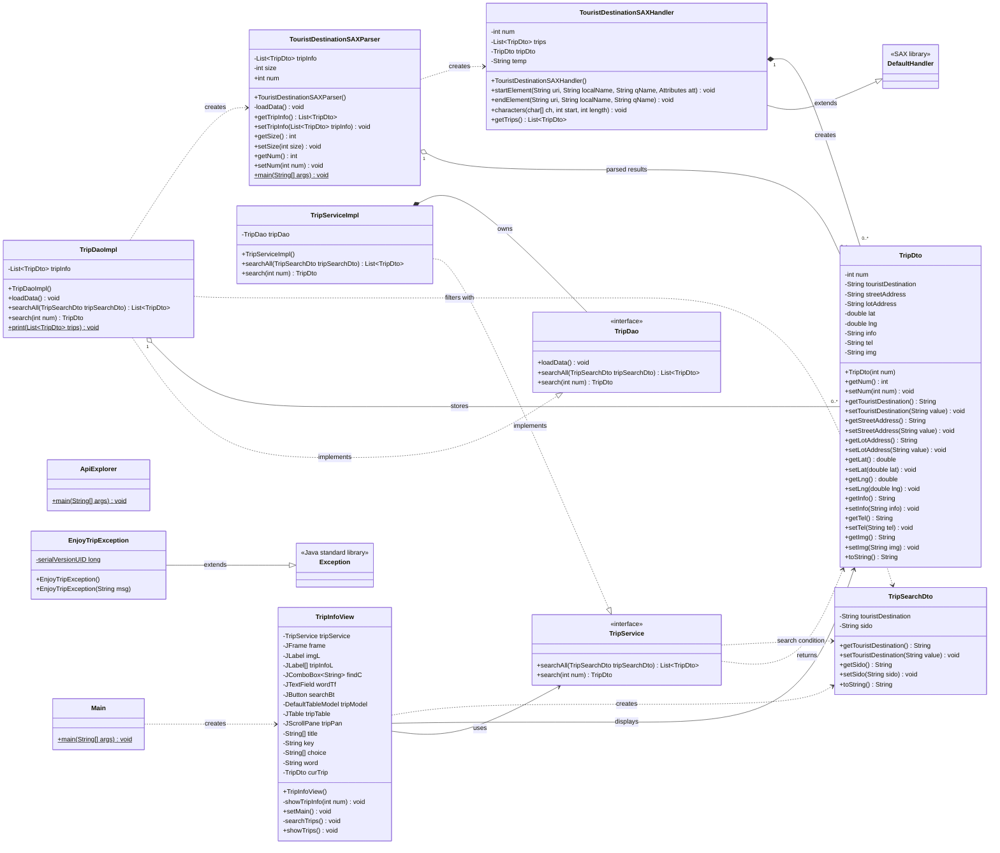

# EnjoyTrip 클래스 다이어그램

## 핵심 흐름

1. `Main`이 `TripInfoView`를 생성해 Swing 화면을 시작한다.
2. `TripInfoView`는 `TripService`를 통해 관광지 목록과 상세 정보를 요청한다.
3. `TripServiceImpl`은 비즈니스 요청을 `TripDao`에 위임한다.
4. `TripDaoImpl`은 `TouristDestinationSAXParser`로 XML 데이터를 읽어 `TripDto` 목록을 보관한다.
5. `TouristDestinationSAXHandler`가 XML의 각 레코드를 `TripDto`로 변환한다.

> `ApiExplorer`는 공공 API 호출 예제용 독립 실행 클래스이며, 현재 애플리케이션 실행 흐름에는 연결되어 있지 않다.
> `EnjoyTripException`도 사용자 정의 예외로 선언되어 있지만 현재 다른 클래스에서 직접 사용하지 않는다.
